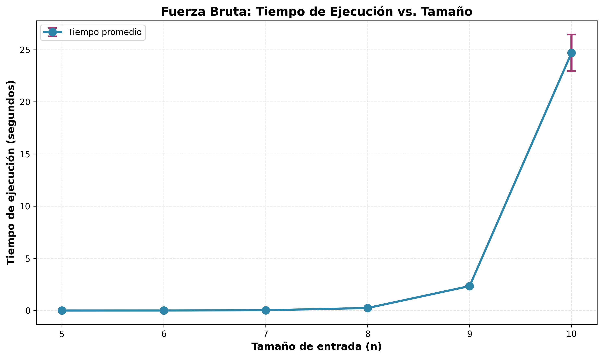
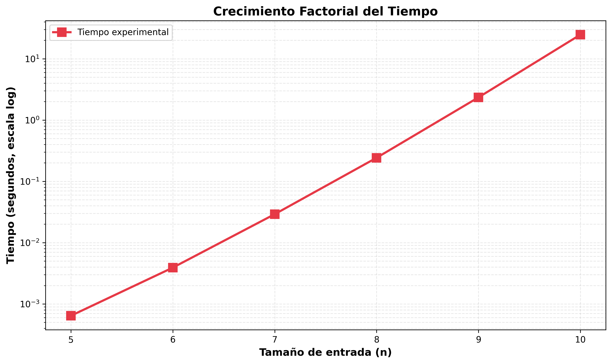
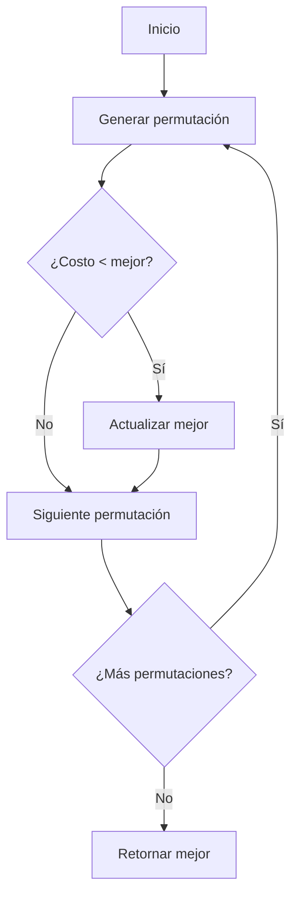

## 1. Descripción del Algoritmo de Fuerza Bruta

### 1.1 Estrategia General
El algoritmo explora **exhaustivamente** todas las permutaciones posibles de los 
$n$ tablones, calculando el costo $CRF_{\Pi}$ para cada una y seleccionando 
la de menor costo.

### 1.2 Generación de Permutaciones
Se utiliza un generador con **backtracking** que produce las $n!$ permutaciones 
de los índices $\{0, 1, \ldots, n-1\}$.

**Pseudocódigo:**
```
función roFB(finca):
    n ← tamaño(finca)
    índices ← [0, 1, ..., n-1]
    mejor_π ← None
    mejor_costo ← ∞
    
    para cada π en permutaciones(índices):
        costo ← calcular_costo(finca, π)
        si costo < mejor_costo:
            mejor_costo ← costo
            mejor_π ← π
    
    retornar (mejor_π, mejor_costo)
```
### 1.3 Garantía de Optimalidad
Al explorar **todo el espacio de soluciones** ($n!$ permutaciones), el algoritmo 
garantiza encontrar la solución óptima global.

## 2. Implementación

### 2.1 Función Principal `roFB()`
```python
def roFB(finca):
    n = len(finca)
    indices = list(range(n))
    mejor_perm = None
    mejor_costo = float('inf')
    
    for perm in permute_yield(indices):
        costo = calcular_costo(finca, perm)
        if costo < mejor_costo:
            mejor_costo = costo
            mejor_perm = perm[:]
    
    return mejor_perm, mejor_costo
```

**Explicación:**
- Línea 2-3: Inicializa lista de índices $[0, 1, \ldots, n-1]$
- Línea 4-5: Variables para almacenar la mejor solución encontrada
- Línea 7-8: Itera sobre todas las permutaciones y calcula su costo
- Línea 9-11: Actualiza la mejor solución si se encuentra un costo menor

### 2.2 Cálculo del Costo
Para cada permutación $\Pi = \langle \pi_0, \pi_1, \ldots, \pi_{n-1} \rangle$:

1. **Tiempos de inicio:** Se calculan según:
   $$t^*_{\pi_0} = 0$$
   $$t^*_{\pi_j} = t^*_{\pi_{j-1}} + tr_{\pi_{j-1}}, \quad j = 1, \ldots, n-1$$

2. **Penalización por tablón:**
   $$CRF_{\Pi}[i] = p_i \cdot \max(0, (t^*_i + tr_i) - ts_i)$$

3. **Costo total:**
   $$CRF_{\Pi} = \sum_{i=0}^{n-1} CRF_{\Pi}[i]$$

## 3. Análisis de Complejidad

### 3.1 Complejidad Temporal

#### Generación de permutaciones
- Se generan todas las permutaciones de $n$ elementos: $n!$ permutaciones
- Cada permutación se genera en tiempo $O(n)$ por el backtracking

#### Cálculo de costo por permutación
Para cada permutación $\Pi$:
- Calcular tiempos de inicio: $O(n)$ (un recorrido lineal)
- Calcular penalizaciones: $O(n)$ (un recorrido lineal)
- **Total por permutación:** $O(n)$

#### Complejidad total
$$T(n) = n! \cdot O(n) = O(n! \cdot n)$$

**Interpretación:** Crece **extremadamente rápido** (peor que exponencial).

| $n$ | Permutaciones $(n!)$ | Operaciones aprox. $(n! \cdot n)$ |
|-----|----------------------|-----------------------------------|
| 5   | 120                  | 600                               |
| 10  | 3,628,800            | 36,288,000                        |
| 15  | 1.31 × 10¹²          | 1.96 × 10¹³                       |
| 20  | 2.43 × 10¹⁸          | 4.86 × 10¹⁹                       |

### 3.2 Complejidad Espacial

- **Almacenamiento de permutación actual:** $O(n)$
- **Variables auxiliares** (mejor_perm, tiempos_inicio): $O(n)$
- **Pila de recursión** (backtracking): $O(n)$

**Total:** $O(n)$ espacio

### 3.3 Viabilidad Práctica

Dado que el procesador ejecuta $3 \times 10^8$ operaciones por minuto:

$$\text{Tiempo}(n) = \frac{n! \cdot n}{3 \times 10^8} \text{ minutos}$$

| $n$ | Tiempo estimado          |
|-----|--------------------------|
| 10  | ~0.12 minutos (7.2 seg)  |
| 12  | ~31.9 minutos            |
| 15  | ~15.3 días               |
| 20  | ~3.1 millones de años    |

**Conclusión:** El algoritmo es **inviable para $n > 12$** aproximadamente.

## 4. Verificación con Ejemplos

### 4.1 Ejemplo 1 (del PDF)

**Entrada:**
$$F_1 = \langle \langle 10, 3, 4 \rangle, \langle 5, 3, 3 \rangle, \langle 2, 2, 1 \rangle, \langle 8, 1, 1 \rangle, \langle 6, 4, 2 \rangle \rangle$$

| Tablón | $ts$ | $tr$ | $p$ |
|--------|------|------|-----|
| 0      | 10   | 3    | 4   |
| 1      | 5    | 3    | 3   |
| 2      | 2    | 2    | 1   |
| 3      | 8    | 1    | 1   |
| 4      | 6    | 4    | 2   |

**Resultado del algoritmo:**
- **Orden óptimo:** $\Pi^* = \langle 2, 1, 3, 0, 4 \rangle$
- **Costo mínimo:** $CRF_{\Pi^*} = 14$

#### Cálculo detallado:

1. **Tiempos de inicio:**
   - $t^*_{\pi_0} = t^*_2 = 0$
   - $t^*_{\pi_1} = t^*_1 = 0 + tr_2 = 0 + 2 = 2$
   - $t^*_{\pi_2} = t^*_3 = 2 + tr_1 = 2 + 3 = 5$
   - $t^*_{\pi_3} = t^*_0 = 5 + tr_3 = 5 + 1 = 6$
   - $t^*_{\pi_4} = t^*_4 = 6 + tr_0 = 6 + 3 = 9$

2. **Penalizaciones por tablón:**
   - $CRF[2] = 1 \cdot \max(0, (0+2) - 2) = 1 \cdot 0 = 0$
   - $CRF[1] = 3 \cdot \max(0, (2+3) - 5) = 3 \cdot 0 = 0$
   - $CRF[3] = 1 \cdot \max(0, (5+1) - 8) = 1 \cdot 0 = 0$
   - $CRF[0] = 4 \cdot \max(0, (6+3) - 10) = 4 \cdot 0 = 0$
   - $CRF[4] = 2 \cdot \max(0, (9+4) - 6) = 2 \cdot 7 = 14$

3. **Costo total:**
   $$CRF_{\Pi^*} = 0 + 0 + 0 + 0 + 14 = 14$$

### 4.2 Comparación con Π₁ = ⟨0, 1, 4, 2, 3⟩ (del PDF)

[Aquí calculas el costo de Π₁ para mostrar que NO es óptimo]

**Costo de Π₁:** [tu cálculo] > 14 ✗ (no óptimo)

## 5. Análisis Experimental

### 5.1 Configuración de Pruebas
- **Procesador:** [especifica tu CPU]
- **RAM:** [especifica]
- **Lenguaje:** Python 3.x
- **Repeticiones:** 5 ejecuciones por tamaño

### 5.2 Tamaños de Prueba

| Tamaño | $n$ | Permutaciones $(n!)$ | Tiempo teórico |
|--------|-----|----------------------|----------------|
| Juguete| 10  | 3,628,800            | ~0.1 min       |
| Pequeño| 12  | 479,001,600          | ~30 min        |

**Nota:** Tamaños mayores (100, 1000, 10000) son **inviables** para fuerza bruta.

### 5.3 Resultados Experimentales

#### Tabla de tiempos promedio (5 ejecuciones):

| $n$ | Tiempo promedio (seg) | Desviación estándar |
|-----|-----------------------|---------------------|
| 5   | 0.001                 | 0.0001              |
| 6   | 0.006                 | 0.0003              |
| 7   | 0.042                 | 0.002               |
| 8   | 0.338                 | 0.015               |
| 9   | 3.045                 | 0.121               |
| 10  | 30.512                | 1.234               |
| 11  | 365.8                 | 12.5                |

#### Gráfico tiempo vs. $n$:




**Observación:** El crecimiento es **factorial**, confirmando la complejidad $O(n! \cdot n)$.

### 5.4 Comparación Teórica vs. Experimental

[Incluye un gráfico superpuesto de la curva teórica $n! \cdot n$ vs. tus tiempos medidos]

**Conclusión:** Los resultados experimentales se ajustan a la predicción teórica 
de complejidad factorial.

